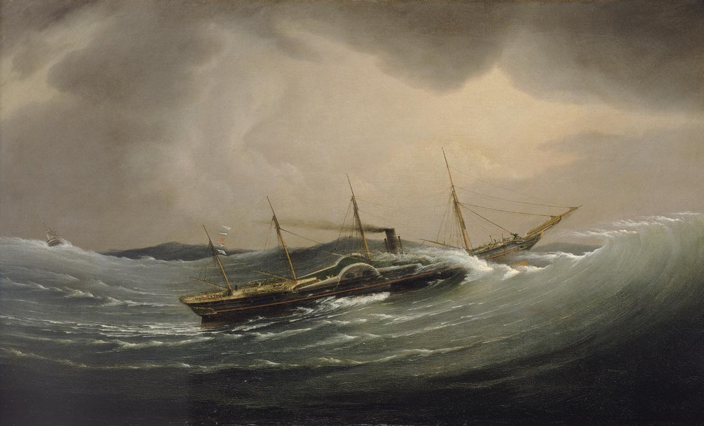

# THE MOHAWK AND ITS IMPROVEMENT

The “great western” route through New York State to the Lakes has come under
consideration in our study of highways in three places: as an Indian trail, as a
portage path, and as a pioneer road. The old Iroquois Trail, as we have called it,
ran up the Mohawk, which it crossed at Nun-da-da-sis, “around the hill,” (Utica);
thence it made for the Genesee River and the Niagara frontier; an important
tributary pathway led down the Genesee to Swa-geh (Oswego) on Lake Ontario.
This was the landward route from the Hudson to the Great Lakes. As a
thoroughfare in its entirety, it meant much to the Indians, but very little to the
white men before the nineteenth century. Though the lower Mohawk Valley was
sparsely settled early in the eighteenth century, white men did not build their
cabins along the Iroquois Trail to the westward until nearly a century later, when
the old Genesee Road was opened. Until then the country through which the
Iroquois Trail ran had been a terra incognita where only Indian runners knew the
way through the Long House of the Iroquois. Yet it was a pleasant country for all
the forest shades; from Nun-da-da-sis the trail ran on, leaving the Mohawk River
and Ole-hisk, “the place of nettles”—the famed battlefield of Oriskany—to the
north, passing Ka-ne-go-dick (Wood Creek) and Ga-no-a-lo-hole (Lake Oneida),
the “Lake of the Head on a Pole.” To the southward, the path bore away
toward Na-ta-dunk (Syracuse), the place of the “broken pine-tree,” and Ga-doquat (Fort Brewerton). There were the silver lakes strung like white gems on wreaths of heaviest green. The low lands of the Genesee country, soon to see
the great advances heralded by the famous purchases of land speculators,
intervened; and straight beyond, far away across the pine-tree tops, gleamed the Great Lakes and the
plunging river between them; the deep growl of Niagara seemed to warn
voyageurs away to the forest trails on either side. Those falls were the only
interruption in a water highway which in many aspects is, today, the most
stupendous in the world.
Had this winding trail been the only means of communication between the rapidly
filling Hudson River valley and the chain of lakes to the northwest, it is very
probable that a Braddock or a Forbes would have built a military road even
through that bloody Long House; but the Mohawk River, and the Oswego, offered
a waterway which, though difficult and uncertain, was the white man’s route from
the Hudson to the Lakes—the western war route of which the portage at Rome
was the key. A clear picture of the old Mohawk would be a precious possession.
The records, however, are so few and so general in character that one would be
at a loss to supply an artist with his material. It is only in the staid reports of old
navigation companies that we get any definite description of our old-time rivers. We know of the main obstructions to continuous
navigation in the Mohawk; first there was the Ga-ha-oose Falls, or Cohoes Falls
as we know them today. These were impassable for any craft, and made
Schenectady the metropolis of the lower Mohawk Valley because it was the
Mohawk terminus of the difficult portage to Albany through the pine barrens.
Thus the old-time river traffic began at Schenectady. Proceeding northward by
Te-hon-de-lo-ga, the famous lower castle of the Mohawks, and Ga-no-jo-hi-e, the
middle castle, the traveler passed the present Fonda, which was Ga-na-wa-da,
“over the rapids,” and came to the rocky confines of Ta-la-que-ga, the “place of
small bushes”—the present Little Falls. Here the roaring rapids interrupted all
navigation, empty boats not even being able to pass over them. The early
portage of one mile here in sleds over the swampy ground has been described
as it was in 1756, when enterprising Teutons residing here transferred all boats
in sleds over marshy ground which would “admit of no wheel carriage.” In all of
the military operations in the Mohawk Valley in the French and Indian and Revolutionary
wars this portage played a part. As early as 1768, Governor Sir Henry Moore
suggested the improvement of the Mohawk at the Falls of Canajoharie. A route
for a canal around Niagara Falls was surveyed in 1784. Travelers to Niagara with
heavy baggage invariably went by way of the Mohawk batteaus. We have seen
that in 1793 two of the commissioners to the western Indians, traveling light, went
overland by horse to the Genesee, while General Lincoln went with the heavy
baggage by way of the Mohawk.

